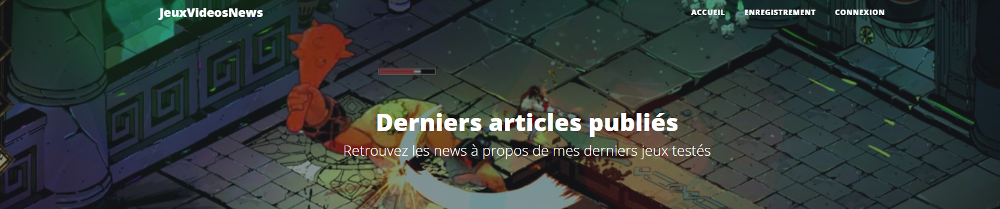
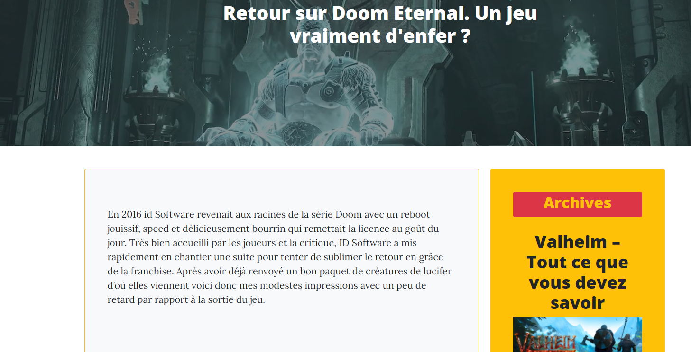

# SimplonDWWM-Symfony-videoGameBlog

First Symfony project with Simplon - __Make a Blog__

Begin to handle Symfony, by integrating a HTML blog template.  

[Voir le site](http://mybloginsymfony.herokuapp.com/)

### Theme
Video Games
### Features

- Install and setup Symfony and Composer
- Create a new project with symfony
- Create controllers
- Split a HTML template and integrate it into a Symfony project
- Split views in blocks to avoid repetitions
- Define the different required routes
- Transit the datas between controllers and views
- Create Database through Symfony
- Handle the users
  - Create a new User controller
  - Configure the routes for log-in, log-out, register, password lost
  - Create the credentials forms
  - Send an mail to confirm the user email, and to reset the password
- Create Entities
- Customize forms
- Use Doctrine to fetch and persist datas.
- Use an WYSIWYG editor to format blog raw datas
- Handle the param converter system
- Request with the entity manager
  - createQuery()
  - createQueryBuider()
- Manage the back-office administration
  - Import an admin front template
  - Securize the admin routes
  - Make the CRUD administration
- Configure Heroku for hosting the project
  - Add mailJet to handle mails

### Technologies

- PHP
- Symfony
- Twig
- Git
- Github
- MySql
- Heroku

### Used Bundles

- symfonycasts/verify-email-bundle
- symfony/mailer
- symfony/mailjet-mailer
- symfonycasts/reset-password-bundle
- antishov/doctrine-extensions-bundle (_Annotations manager_)
- friendsofsymfony/ckeditor-bundle (_WYSIWYG editor_)
- twig/string-extra (_Twig extra tools_)
- symfony/translation (_Change the symfony language_)
- orm-fixtures

### Services
- Emails handler : [MailHog](https://github.com/mailhog/MailHog)

__ENJOY__

