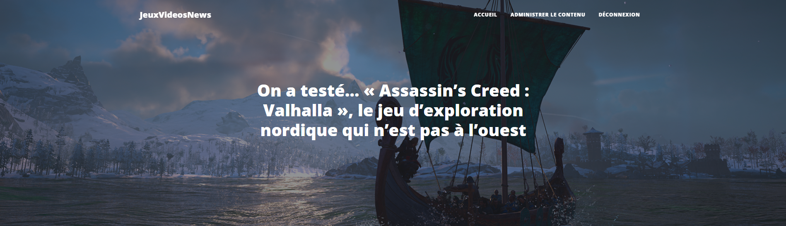

# SimplonDWWM-Symfony-videoGameBlog

First Symfony project with Simplon - __Make a Blog__

Begin to handle Symfony, by integrating a HTML blog template.
[Voir le site](http://mybloginsymfony.herokuapp.com/)


> Summary

- [SimplonDWWM-Symfony-videoGameBlog](#simplondwwm-symfony-videogameblog)
- [Milestones](#milestones)
- [Install the project](#install-the-project)
    - [Create and populate the database](#create-and-populate-the-database)
    - [Lauch the symfony server](#lauch-the-symfony-server)
    - [Built-in command lines](#built-in-command-lines)
    - [Display the page in the browser](#display-the-page-in-the-browser)
- [Connection to the blog](#connection-to-the-blog)
- [Used technologies](#used-technologies)
- [Used Bundles](#used-bundles)
- [Services](#services)

# Milestones

- Install and setup Symfony and Composer
- Create a new project with symfony
- Create controllers
- Split a HTML template and integrate it into a Symfony project
- Split views in blocks to avoid repetitions
- Define the different required routes
- Transit the datas between controllers and views
- Create Database with Symfony and doctrine
- Handle the users
  - Create a new User controller
  - Configure the routes for log-in, log-out, register, password lost
  - Create the credentials forms
  - Send an mail to confirm the user email, and to reset the password
- Create Entities
- Customize forms
- Use Doctrine to fetch and persist datas.
- Use an WYSIWYG editor to format blog raw datas
- Handle the param converter system
- Request with the entity manager
  - createQuery()
  - createQueryBuider()
- Manage the back-office administration
  - Import an admin front template
  - Securize the admin routes
  - Make the CRUD administration
- Security
  - Configure 3 roles in the project [USER, ADMIN and SUPER_ADMIN]
  - Handle authorizations depending to the user's role
- Configure Heroku for hosting the project
  - Add mailJet to handle mails in production

[Back to top](#simplondwwm-symfony-videogameblog)
# Install the project

- Clone / fork the repository on your computer
- Install [Composer](https://getcomposer.org/download/) if needed
- Use composer to install project dependencies

```sh
composer i
```

- Change the database informations in the .env file in your folder project
  > **If you have some sensitive credentials, please create a .env.local file which will be a copy of the .env file and put your sensitive data inside.**

### Create and populate the database

```sh
# Create database with symfony doctrine ORM
php bin/console doctrine:database:create

# Create the tables
php bin/console make:migration
php bin/console doctrine:migration:migrate

# Populate the database with fake data
php bin/console doctrine:fixtures:load
```

[Back to top](#simplondwwm-symfony-videogameblog)
### Lauch the symfony server

```sh
php bin/console server:start --no-tls
```

### Built-in command lines

```sh
# Create the database, the tables and load fake data
composer db:install

# Drop the database, et reload the db:install operations
composer db:reload

# Start the symfony server
composer start
```

### Display the page in the browser
Connect to the page http://localhost:8000/ at localhost

[Back to top](#simplondwwm-symfony-videogameblog)
# Connection to the blog
You can connect to the application with identifiers below:

> user@user.fr `Password:` _password12345_<br />
> admin@admin.fr `Password:` _password12345_

# Used technologies

- PHP
- Symfony
- Twig
- Git
- Github
- MySql
- Heroku
# Used Bundles

- symfonycasts/verify-email-bundle
- symfony/mailer
- symfony/mailjet-mailer
- symfonycasts/reset-password-bundle
- antishov/doctrine-extensions-bundle (_Annotations manager_)
- friendsofsymfony/ckeditor-bundle (_WYSIWYG editor_)
- twig/string-extra (_Twig extra tools_)
- symfony/translation (_Change the symfony language_)
- orm-fixtures

[Back to top](#simplondwwm-symfony-videogameblog)
# Services
- Email handler : [MailHog](https://github.com/mailhog/MailHog) (local only)

__ENJOY__



[Back to top](#simplondwwm-symfony-videogameblog)
